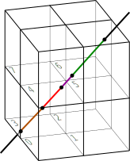

# Overlap of a ray and a volume cell (voxel) [](https://travis-ci.org/cherenkov-plenoscope/ray_voxel_overlap)

Estimate the euclidean overlap passed by a ray within a rectangular volume cell (voxel).



For a given, rectangular space partitioning in 3D, and a given ray the overlap of all voxels with the ray is estimated.
The figure shows a ray and its overlap with voxels.
A brown overlap with voxel ```3```, a red overlap with voxel ```0```, a purple overlap with voxel ```4```, and a green overlap with voxel ```5```. The ray is defined by its support and direction vectors. The space-partitioning is defined by its bin-edges.

## Tomographic system-matrix

```python
import numpy as np
import ray_voxel_overlap as rvo

np.random.seed(0)

N_RAYS = 100
supports = np.array([
    np.random.uniform(-2.5, 2.5, N_RAYS),
    np.random.uniform(-2.5, 2.5, N_RAYS),
    np.zeros(N_RAYS)
]).T

directions = np.array([
    np.random.uniform(-0.3, 0.3, N_RAYS),
    np.random.uniform(-0.3, 0.3, N_RAYS),
    np.ones(N_RAYS)
]).T

norm_directions = np.linalg.norm(directions, axis=1)
directions[:, 0] /= norm_directions
directions[:, 1] /= norm_directions
directions[:, 2] /= norm_directions

N_X_BINS = 8
N_Y_BINS = 13
N_Z_BINS = 7
system_matrix = rvo.estimate_system_matrix(
    supports=supports,
    directions=directions,
    x_bin_edges=np.linspace(-100., 100., N_X_BINS+1),
    y_bin_edges=np.linspace(-100., 100., N_Y_BINS+1),
    z_bin_edges=np.linspace(0., 200., N_Z_BINS+1),
)
```
## How it is done
To be fast, the production-code is written in ```C``` and wrapped in ```cython```. But for development, there is a ```python``` implementation.

## Authors
Sebastian A. Mueller,

ETH-Zurich, Switzerland (2014-2019),

MPI-Heidelberg, Germany (2019-)
